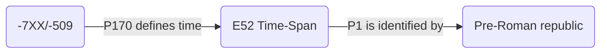
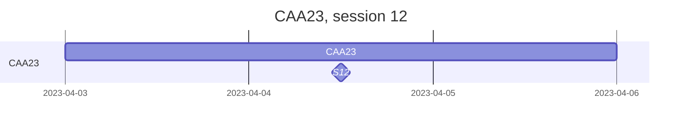

# CAA23
> https://2023.caaconference.org/

## CIDOC-CRM
> Use of EDTF and CIDOC-CRM

## Session 12: Chronological modelling: formal methods and research software
> Eythan Levy, Thomas Huet, Florian Thiery, Allard W. Mees

### Timeline 

* General Introduction to S12: https://historical-time.github.io/caa23/s12/pres
* Discussing the need for a new CAA Special Interest Group on chronological modelling: https://historical-time.github.io/caa23/sig/pres