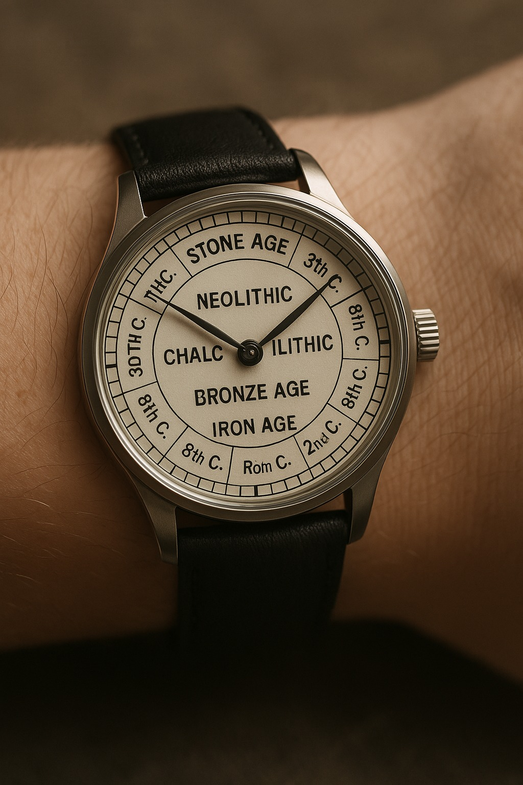

# SIG Chrono
> CAA Special Interest Group on chronological modelling (SIG Chrono), caa-chrono-sig

	<em>Archaeology has no future</em> 
	

The ambition of the SIG Chrono is to model temporal processes that underlie archaeological features regardless of the accuracy or fuzziness of temporal data. These archaeological features can be archaeological periods, site stratigraphies, object "chaîne opératoires" or personal genealogies. We aim to create bridges with the SSLA SI and the LOD one. To do so, we aim to back our work on standard formats, such as the Extended Date Time Format, formalisms such as Directed Acyclic Graphs, open-source softwares (in construction), time-period gazetteers such as Periodo, and so on, following the LOD and FAIR principles in a collaborative way.

## Useful links

* CAA SIG: https://caa-international.org/special-interest-groups/
* Huet, T., & Levy, E. (eds) (2025). [Special issue on Chronological modelling](https://onlinelibrary.wiley.com/toc/14754754/2025/67/S1). Archaeometry, 67(S1). 
  
## Mailing list

### Suscribe

To register to the `caa-chrono-sig@framagroupes.org` mailing list, send a message to `sympa@framagroupes.org` with this **Subject** (leave body empty or put a short message):

- SUBSCRIBE caa-chrono-sig *Firstname* *Lastname*

Replace *Firstname* and *Lastname* with your real name or identifier, ex: 'SUBSCRIBE caa-chrono-sig John Doe'

### Unsuscribe

To unsuscribe from the `caa-chrono-sig` mailing list, same process as above, with this **Subject**

- UNSUBSCRIBE caa-chrono-sig

# The SIG Chrono @t the CAA

## CAA23
> https://2023.caaconference.org/, 2023-04-03/2023-04-06, Amsterdam

### S12: Chronological modelling: formal methods and research software
> Eythan Levy, Thomas Huet, Florian Thiery, Allard W. Mees

* General Introduction to S12: https://historical-time.github.io/caa-chrono-sig/caa/23/s12/pres
* Discussing the need for a new CAA Special Interest Group on chronological modelling: https://historical-time.github.io/caa-chrono-sig/sig/pres

## CAA25
> https://2025.caaconference.org/, 2025-05-05/2023-05-09, Athens

### S1: Chronological modelling II: formal methods and research software
> Eythan Levy, Thomas Huet

## CAA26

### Sx: Chronological Modelling III: a Round Table on Time on Computational Archaeology
> Thomas Huet, Eythan Levy

This round table aims at discussing the current challenges and future perspectives on the modelling of time in archaeology. Duration: 2h30.

Some 30 years ago, the introduction of GIS into the archaeological toolbox sparked a ‘spatial turn’ in the discipline, greatly improving the interoperability of spatial data. However, no such integrated tool exists for managing temporal data. Chronological methods are highly diverse (e.g., seriation, stratigraphy, cross-dating, absolute dating), each typically handled by different software applications and libraries. The lack of interoperability between software outputs, formats and standards hinders the ability to understand cultural developments across different societies. In our view, the time has come to make chronological data more interoperable through the use of standardised formats (e.g., EDTF), relative temporal relationships (e.g., before/after), and specialised software (e.g., OxCal). Such an approach could pave the way for a Temporal Information System (TIS), enabling the calculation of a temporal metric for the rate of human cultural evolution (see our position paper: Huet & Levy, 2025). We invite all interested colleagues to participate in the open-forum discussion at the round table.

**Position paper**

Huet, T., & Levy, E. (2025). Foreword – Archaeometry special issue on chronological modeling. Archaeometry, 67(S1), 1–6. https://doi.org/10.1111/arcm.13095 

#### Session organisation

**Foreword [5-10 minutes]**
> Thomas Huet and Eythan Levy

**Topic 1: Epistemology of archaeological time** [30 minutes]
> chair: Joan Anton Barcelo

History and Archaeology, sciences of societies in time, are based on the ordering and clustering of events, but differ mainly on the different nature of the proxies they use. History uses mainly authored time-stamped writings (e.g., diplomatic letters, political writings) while Archaeology uses anonymous time-uncertain material culture (e.g., ceramic and stratigraphic sequences). How can such archaeological series be grouped to create periods? To what extent can two periods be considered as contemporaneous ?  

**Topic 2: Archaeological time in practice: cross dating, anchor dates, cultural periods** [30 minutes]
> chair: Keith May, James Taylor

Archaeologists often deal with multi-aligned chronological data: a piece of material culture can be related to a stratigraphic unit containing other objects, to site-wide stratigraphy with groupings and phasing, to broader landscape and/or cultural periodisation, to seriation, to artifact types found in other archaeological cultures, and to so-called ‘absolute’ dates from scientific dating methods (e.g., radiocarbon dates). How, in practice, are these data aligned with each other? How is uncertainty propagated over different chronological assessments?

---

 BREAK: 15 minutes 

---

**Topic 3: Formats, standards and interoperability** [30 minutes]
> chair: Florian Thierry

Deterministic dates, whether seemingly exact (e.g., 79 AD), approximate with uncertainties (e.g., 80/81 AD), or relative (e.g., after 68 AD), can be encoded unambiguously using standards such as ISO 8601, EDTF, or OWL-Time. Such date expressions can serve as the basis for space–time gazetteers (e.g., PeriodO and ChronOntology) and be reused in ontologies (e.g., CIDOC CRM). However, these formats, gazetteers and ontologies cannot directly express probabilistic temporal distributions, such as those derived from radiometric dating. Furthermore, the different ad hoc chronological formats and syntaxes used by chronological software (e.g., OxCal, ChronoModel, or ChronoLog) add a further layer of complexity. How can we foster interoperability between all these formats and standards?

**Topic 4: Mathematics, Algorithms and Software** [30 minutes]
> chair: Joe Roe

A host of mathematical methods and algorithms exist for both deterministic and probabilistic temporal assessments in archaeology. Software packages (libraries), as well as interactive software applications, are being used to solve a wide variety of chronological problems, such as seriation, Bayesian calibration of radiocarbon dates, or chronological network modelling. Mastering the whole array of available chronological methods, algorithms and tools can be challenging. Is a unified, standardised approach feasible and desirable? And if so, what concrete steps can be taken to achieve it?

**Conclusion: Towards a Temporal Information System?** [5-10 minutes]
