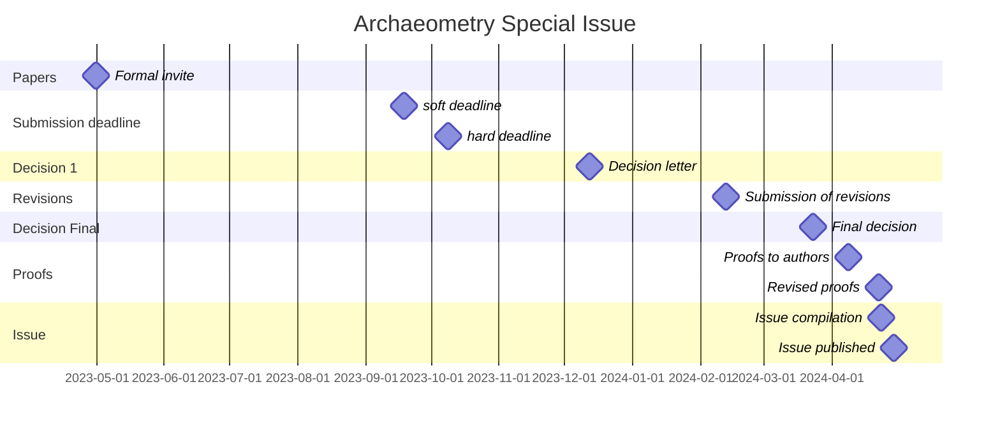

# Archaeometry Special Issue
Publication of an Archaeometry Special Issue on Chronological Modeling

## Timeline

```mermaid
gantt
    title Archaeometry Special Issue
    dateFormat  YYYY-MM-DD
    section Papers
    Formal invite              : milestone, m0, 2023-04-30, 1d
    section Submission deadline
    soft deadline            : milestone, m1, 2023-09-18, 1d
    hard deadline            : milestone, m1, 2023-10-08, 1d
    section Decision 1
    Decision letter          : milestone, m1, 2023-12-12, 1d
    section Revisions
    Submission of revisions	 : milestone, m1, 2024-02-12, 1d
    section Decision Final
    Final decision           : milestone, m2, 2024-03-23, 1d
    section Proofs
    Proofs to authors        : milestone, m2, 2024-04-08, 1d
    Revised proofs           : milestone, m2, 2024-04-22, 1d
    section Issue
    Issue compilation        : milestone, m2, 2024-04-23, 1d
    Issue published          : milestone, m2, 2024-04-29, 1d
```
