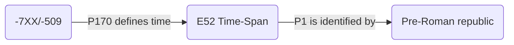

# Archaeometry Special Issue
> Publication of an Archaeometry Special Issue on Chronological Modeling

## Timeline

# Sample dataset
> Use of standards to share dates between different research projects

Authors are asked to share samples of their temporal data using standardised formats

## CIDOC-CRM
> Use of EDTF and CIDOC-CRM

