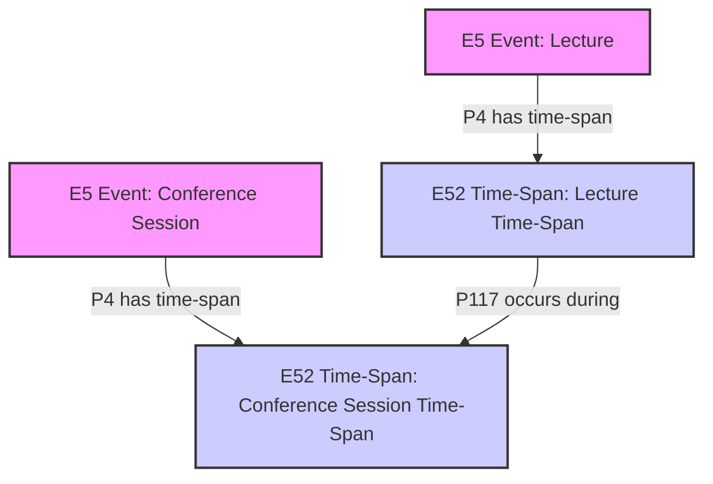
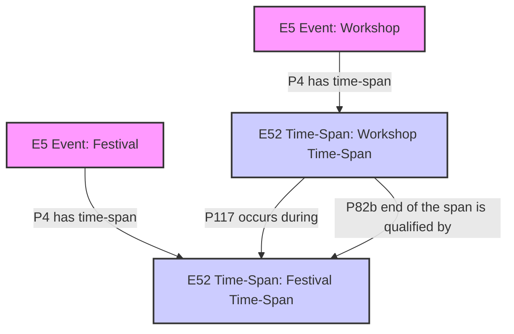

## Starts during
> .. using ChatGPT

```mermaid
graph TD;
    EventA[E5 Event: Lecture]
    EventB[E5 Event: Conference Session]
    TimeSpanA[E52 Time-Span: Lecture Time-Span]
    TimeSpanB[E52 Time-Span: Conference Session Time-Span]

    EventA -->|P4 has time-span| TimeSpanA
    EventB -->|P4 has time-span| TimeSpanB
    TimeSpanA -->|P117 occurs during| TimeSpanB

    classDef eventName fill:#f9f,stroke:#333,stroke-width:2px;
    classDef timeSpanName fill:#ccf,stroke:#333,stroke-width:2px;
    class EventA,EventB eventName;
    class TimeSpanA,TimeSpanB timeSpanName;
```

## Ends during
> .. using ChatGPT

```mermaid
graph TD;
    EventA[E5 Event: Workshop]
    EventB[E5 Event: Festival]
    TimeSpanA[E52 Time-Span: Workshop Time-Span]
    TimeSpanB[E52 Time-Span: Festival Time-Span]

    EventA -->|P4 has time-span| TimeSpanA
    EventB -->|P4 has time-span| TimeSpanB
    TimeSpanA -->|P117 occurs during| TimeSpanB
    TimeSpanA -->|P82b end of the span is qualified by| TimeSpanB

    classDef eventName fill:#f9f,stroke:#333,stroke-width:2px;
    classDef timeSpanName fill:#ccf,stroke:#333,stroke-width:2px;
    class EventA,EventB eventName;
    class TimeSpanA,TimeSpanB timeSpanName;
```