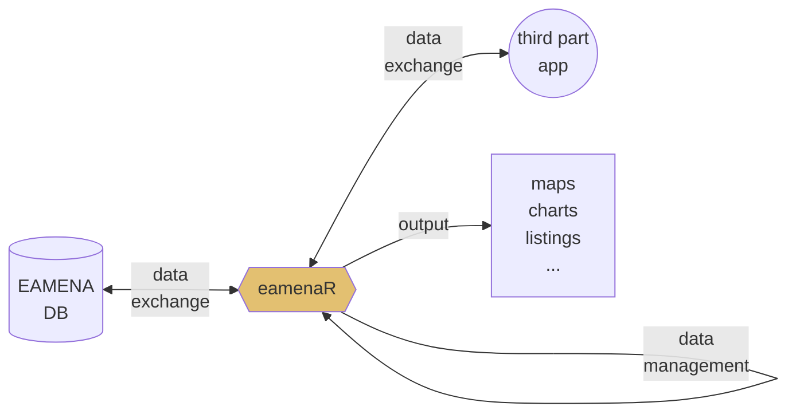

# NeoNet modelling
> Creating Bayesian modelling for radiocarbon dates and stratigraphy of the **NeoNet** dataset

NeoNet [online app](http://shinyserver.cfs.unipi.it:3838/C14/) (see also [GitHub](https://github.com/zoometh/neonet)) dynamically maps **radiocarbon dates** of the Mesolithic/Neolithic transition, and records other contextual information (stratigraphic units, cultural periods, etc.). 

<p align="center">
  
  <br>
    <em>caption</em>
</p>

## Developments

NeoNet IT development is to

1. reconstruct the [stratigraphy](https://github.com/historical-time/caa23/tree/main/neonet#stratigraphy) of these archaeological sites using DAGs (directed acyclic graphs);
2. merged [cultural periods](https://github.com/historical-time/caa23/tree/main/neonet#cultural-periods) from the https://devr.cepam.cnrs.fr/shinyapps/leap/ application with this model;

## Stratigraphy

To reconstruct the stratigraphy, we will use Harris matrices:

### Shiny interactive form

The R Shiny interactive app is composed of an editable dataframe (first tab panel) and a dataset (second tab panel). The first tab panel, "Site Startigraphy", samples a site from the NeoNet dataset[^1]

<p align="center">
  
  <br>
    <em>By default the app opens on "Pokrovnik"</em>
</p>

The second tab panel, "All sites", the whole dataset. A specific site can be selected in the selection search bar (top-right). Then the Site Name can be copied from the SiteName column (highlighted in blue)

<p align="center">
  
  <br>
    <em>Selection of the "Roc du Dourgne" site</em>
</p>

And copied into the first tab panel "Site Startigraphy"

<p align="center">
  
  <br>
    <em>"Roc du Dourgne" site in the editable dataframe, ordered on the "Period" column</em>
</p>

The startigraphical relationships, using "LabCode", can be added into the "After" column, and thereafter exported in CSV

<p align="center">
  
  <br>
    <em>"Roc du Dourgne" stratgraphical relationships using LabCode identifiers, ordered on the "LabCode" column</em>
</p>

Pressing the CSV button (top-left) will export the "Roc du Dourgne" data in a CSV file that can be read by the `neo_strat()` function

```R
neo_strat(inData = 'https://raw.githubusercontent.com/historical-time/data-samples/main/neonet/Roc du Dourgne_2023-07-30.csv',
          outLabel = c("C14Age"))
```
Gives:

<p align="center">
  
  <br>
    <em>"Roc du Dourgne" stratgraphical relationships using LabCode identifiers, ordered on the "LabCode" column</em>
</p>

And

```R
neo_strat(inData = 'https://raw.githubusercontent.com/historical-time/data-samples/main/neonet/Roc du Dourgne_2023-07-30.csv',
          outLabel = c("PhaseCode"))
```
Gives:

<p align="center">
  
  <br>
    <em>"Roc du Dourgne" stratgraphical relationships using LabCode identifiers, ordered on the "LabCode" column</em>
</p>

Changing the `outLabel` to `Period` allows to color on periods using the default hexadecimal color  attributed to each period (see the chapter "Period" in the [NeoNet web tutorial](https://zoometh.github.io/neonet/#3_data_panel))

```R
neo_strat(inData = 'https://raw.githubusercontent.com/historical-time/data-samples/main/neonet/Roc du Dourgne_2023-07-30.csv',
          outLabel = c("Period"))
```
Gives:

<p align="center">
  
  <br>
    <em>"Roc du Dourgne" stratgraphical relationships using LabCode identifiers, ordered on the "LabCode" column</em>
</p>

    - merge Harris matrices with the same [Period](https://zoometh.github.io/neonet/#mf.period) between different sites, culures, periods, etc.
    - process the radiocarbon dates and stratigraphic relationships to perform **Bayesian modelling** on-the-fly;

Using [neo_strat()](https://github.com/historical-time/caa23/blob/main/neonet/functions/neo_strat.R) function for this [dataset sample](https://github.com/historical-time/data-samples/blob/main/neonet/TEST_2.tsv) (site: Obagues de Ratera) coming from the NeoNet dataset, showing:



### PhaseCode

<p>

The **layer names** (by default): ```neo_strat()```<br>

</p>

### C14Age

<p>

The **c14 ages** :  ```neo_strat(outLabel = c("C14Age"))```<br>

</p>

<p>

### Period

The **periods** (for another dataset, and Pokrovnik site only) : <br> 
```
neo_strat(inData = 'https://raw.githubusercontent.com/historical-time/data-samples/main/neonet/TEST_PERIOD.tsv',
          smp.sitename = c("Pokrovnik"),
          outLabel = c("Period")
```
<br>

</p>

## Cultural Periods

Using [neo_leapfrog()](https://github.com/historical-time/caa23/blob/main/neonet/functions/neo_leapfrog.R) function to merge dataframe from NeoNet and Leapfrog on common C14 LabCode values: <https://historical-time.github.io/caa23/neonet/results/NN_and_LF.html>

<p>

Interactive dataframe: ```neo_leapfrog(DT = T)```<br>
<br>
<em>Screen capture of [NN_and_LF.html](https://historical-time.github.io/caa23/neonet/results/NN_and_LF.html)</em>
</p>

    - merge Harris matrices with the same [Culture](https://zoometh.github.io/neonet/#3_data_panel)[^1] between different sites 


[^1]: <http://mappaproject.arch.unipi.it/mod/files/140_140_id00140_doc_elencoc14.tsv>
[^2]: The latter will be named after the site name and current date, for example: "Roc du Dourgne_2023-07-30.csv"